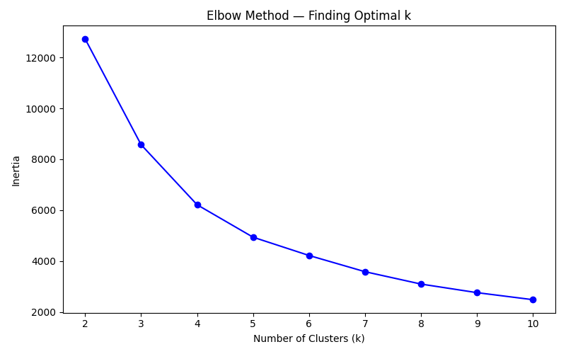

# pharmacy-inventory-clustering
An unsupervised machine learning project that segments pharmacy products into behavioral clusters to identify overstock, dead stock, and healthy inventory — helping prevent medication expiration and reduce waste.

# Background:
I am a pharmacist working in a community pharmacy, currently studying Health Informatics with a focus on AI and Data Science. This is my first machine learning project — built both to learn data science fundamentals and to solve a real problem I face daily at work:
Which products are overstocked and not moving, and what should I do about them?

# Business Problem:
Community pharmacies face a constant challenge with inventory management:
Overstocked products expire before they sell → financial loss
Some products sell better in other pharmacies → can be redistributed
Manual tracking across hundreds of products is inefficient
This project uses KMeans clustering to automatically segment 1188 pharmacy products into actionable groups.

# Dataset:
Source: Real pharmacy inventory data (de-identified)
Size: 1188 active products after cleaning 1410 products
Features used: Sales velocity, overstock ratio, days of supply, sell-through rate, return rate, price per item, product type
Raw data is not shared for privacy reasons. A de-identified sample is provided in sample_clusterd.csv as final deleverable from this project.

# Pipeline
Raw Data (3 product types)
    ↓
01_load_and_merge.py         → Load and merge inventory + sales files
02_preprocessing.py          → Fix data types, handle nulls
03_combine_and_engineer.py   → Combine files, engineer return features Calculate Sell Through Rate, Overstock Ratio, Days of Supply
04_clustering_preprocessing.py → Handle outliers, encode product type
05_clustering_model.py       → Scale features, find optimal k
06_train_and_label.py        → Train KMeans, assign business labels
07_evaluation_and_visualization.py → PCA plot, Silhouette Score

# Key Engineering Decisions
Used RobustScaler instead of StandardScaler — data has significant outliers
Replaced inf values with max * 2 to penalize extreme overstock products
Dropped inactive products (zero sales AND zero returns) before clustering
Chose k=3 based on Silhouette Score (0.79) and business interpretability

# Cluster Results:
-Overstock 
Products that are just sitting on the shelf and barely selling. At this rate, it will take 5 years to sell them all.
-Good Sellers 
Products that are selling faster than we can stock them. Healthy and no action needed.
-Bulk Products 
Products that sell a lot but we also buy a lot of. They're fine but need to be watched so we don't over-order.

# Model Evaluation:
Silhouette Score    : 0.7966 → Reasonable ✅
Variance Explained  : 92.0%  → Good compression ✅
Visual Separation   : Clear  → Clusters are real ✅

# PCA Cluster Visualization

# Elbow Method

# Silhouette Score

# What's Next
 -Build a classification model using cluster labels as target variable
 -Build an interactive dashboard to present results
 -Automate reorder recommendations based on cluster assignment

# Author
Norah Nasser
Pharmacist | Healthcare Data Scientist | Health Informtics Master Student

